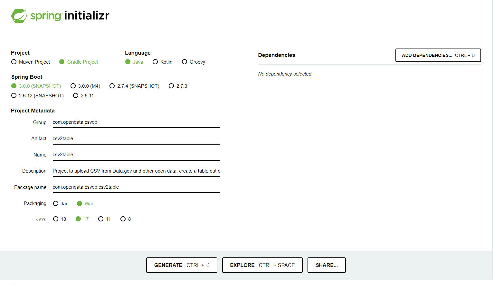

# csv2table
This is an attempt at building a generic CSV to database table solution for offline exploration and management of various CSV files. 

There so many CSV files that are available on open data sites such as [Data.gov](https://data.gov/) and [Kaggle.com](https://www.kaggle.com/datasets). Managing these in a file/folder structure in your local disk is cumbersome, what if you had a locally deployed web app to upload them, add metadata about them and access them via REST API or GraphQL interface in your other applications?

Still under ideation but some thoughts are:
* Learn SpringBoot and host a server web application using Spring's embedded tomcat and Thymeleaf templating.
* Make CSV upload, preview and storing into a DB very seamless experience.
* Generic data model that can handle upto 50 MB files and 200 columns in the CSV file.
* Based on each table created from a CSV file, automatically make the data available via a REST API or GraphQL interface.

# Technologies and Tools
* [SpringBoot](https://spring.io/projects/spring-boot) 3.0.0 
* JDK - [Azul Zulu JDK 17](https://www.azul.com/downloads/?package=jdk#download-openjdk)
* IDE - [IntelliJ IDEA Community Edition](https://www.jetbrains.com/idea/download/)
* [Gradle 7.5](https://docs.gradle.org/7.5/release-notes.html)
* [Thymeleaf](https://www.thymeleaf.org/) for html templates.
* [OpenCSV 5.7.0](http://opencsv.sourceforge.net/)
* [JUnit 4.13.2](https://github.com/junit-team/junit4/blob/HEAD/doc/ReleaseNotes4.13.2.md)

# Setup IDE
1. Git clone repo via https or SSH
2. Import project into IntelliJ IDEA Community version.
3. Refresh gradle tasks or run `./gradlew build` from command line.
4. From IDEA - "Run" `Csv2tableApplication` to start embedded Tomcat webapp
5. Access application in https://localhost:8080

# Starter Project
Created project from [Spring Initializr](https://start.spring.io/) with the following settings:
