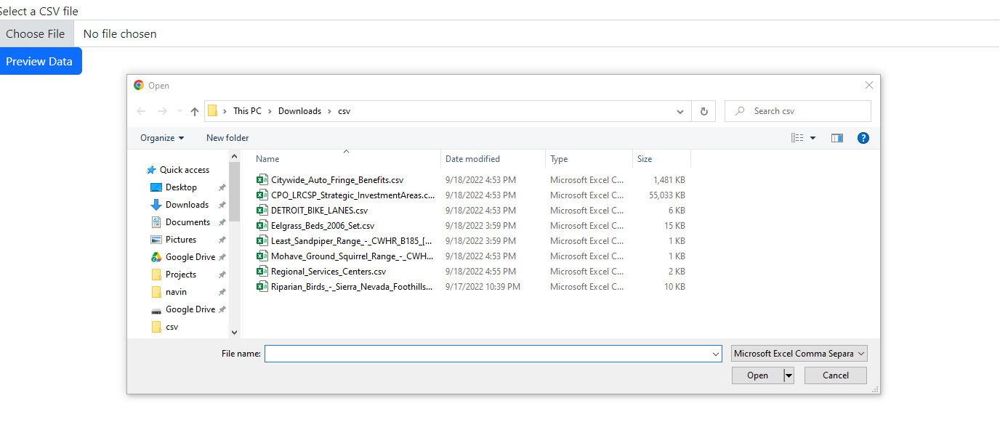
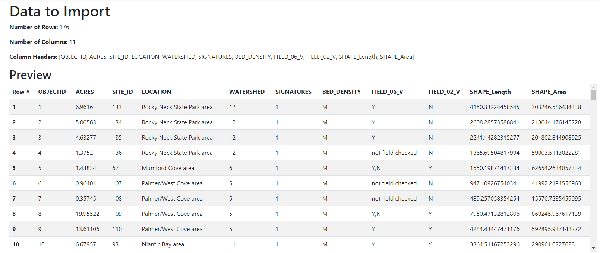
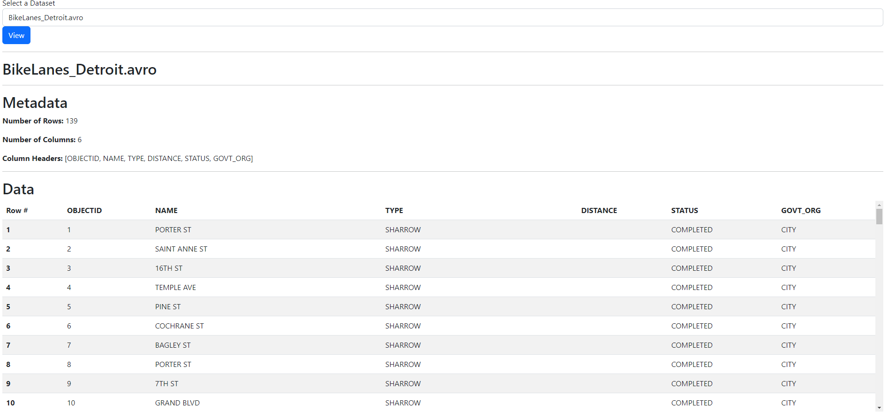

# csv2dataset

This is an attempt at building a generic CSV to dataset solution for offline exploration and management of various CSV
files.

# Problem

* Many CSV files that are available on open data sites such as [Data.gov](https://data.gov/)
  and [Kaggle.com](https://www.kaggle.com/datasets).
* Managing these in a file/folder structure in your local disk as CSV files is complex and consumes a lot of disk
  space.
* Finding these random CSV files across the internet and bookmarking them is also time-consuming.

# Solution

* What if you had a locally deployed web app to upload the files, add metadata about them?
* What if you could achieve a 60%-90%+ compression of the data from its original file size using the
  Apache [Avro](https://avro.apache.org/docs/current/api/java/org/apache/avro/file/DeflateCodec.html) format with binary
  compression instead of CSV?
* What if you could expose the data as a generic REST API or GraphQL interface using the Avro files that is JSON
  friendly?

*Still under development* but some initial technical design thoughts are:

1. Use SpringBoot and host a server web application using Spring's embedded Tomcat web server and Thymeleaf templates
   for server-side data rendering.
2. Make CSV upload, preview and storing into an Avro file very seamless experience.
3. Generic data model that can handle up to 100 MB files and 50 columns in the CSV file. File size can be changed via a
   property.
4. Web application allows you to "Manage Datasets" with the data read from Avro files on disk, preview them really fast
   and add metadata/tags to organize them.
5. Based on each dataset created from a CSV file, automatically make the data available via a REST API or GraphQL
   interface.

# Technologies

This project uses

* JDK - [Azul Zulu JDK 17](https://www.azul.com/downloads/?package=jdk#download-openjdk)
* IDE - [IntelliJ IDEA Community Edition](https://www.jetbrains.com/idea/download/)
* Build - [Gradle 7.5](https://docs.gradle.org/7.5/release-notes.html)

# Dependencies

* [SpringBoot](https://spring.io/projects/spring-boot) 3.0.0
* [Thymeleaf](https://www.thymeleaf.org/) for html templates.
* [OpenCSV 5.7.0](http://opencsv.sourceforge.net/)
* [Apache Spark](https://spark.apache.org/) 2.13
* [Apache Avro](https://avro.apache.org/) 1.11
* [JUnit 4.13.2](https://github.com/junit-team/junit4/blob/HEAD/doc/ReleaseNotes4.13.2.md)

# Setup IDE

1. Git clone repo via https or SSH
2. Import project into IntelliJ IDEA Community version.
3. Refresh gradle tasks or run `./gradlew build` from command line.
4. From IDEA - "Run" the main class `Csv2DatasetApplication` to start embedded Tomcat server.
5. Access application in http://localhost:8080

# Starter Project

Created project from [Spring Initializr](https://start.spring.io/) with the following settings:

# Screenshots

## Import Dataset

This is where you can upload any CSV file to process into Avro files.

## Preview Dataset

This page shows you a preview of the rows before you process the import. It also allows you to specify a dataset
name and other metadata to store for the Avro schema.

## Manage Datasets

This page has a dropdown of all the Avro files imported. Clicking "View" shows the file metadata and full data using
[Avro DatafileReader](https://avro.apache.org/docs/current/api/java/org/apache/avro/file/DataFileReader.html) that makes
page load very snappy.
